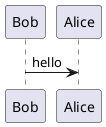

# Typora PlantUML 插件

一个面向 Typora 的独立 PlantUML 插件。它会识别 ` ```plantuml ` 代码块，在编辑区内自动渲染为图片，并提供回退编辑、手动刷新、围栏补全和基础生命周期清理。

## 当前能力

- 自动识别 `plantuml` fenced code block 并渲染为图片
- 对已存在代码块和新建代码块都支持实时检测
- 编辑中对空块、未闭合 `@start.../@end...` 的内容跳过渲染，避免错误页闪烁
- 双击预览图回到源码编辑；退出编辑后重新提取内容再渲染
- `Ctrl+Shift+U` 手动刷新当前 PlantUML 块
- ` ```pla ` 触发 `plantuml` 围栏补全
- 当块被删除或语言改走时，自动清理预览、内部状态和待执行定时器
- 根目录 `tests/plantuml/` 提供 Node 可直接运行的回归测试

## 安装

### 目录

当前运行入口默认查找 Typora 的 `plugin` 目录，而不是 `plugins`：

- Windows: `Typora安装目录/resources/plugin/`
- macOS: `Typora.app/Contents/Resources/plugin/`
- Linux: `Typora安装目录/resources/plugin/`

如果目录不存在，请手动创建。

### 复制文件

将仓库里的整个 `typora_plugin/plugin` 目录复制到 Typora 的 `resources/` 下，使最终路径类似：

```text
resources/
├── plugin/
│   ├── index.js
│   ├── core/
│   ├── custom/plugins/core/
│   ├── custom/plugins/plantuml/
│   └── global/settings/custom_plugin.user.toml
└── window.html
```

### 注入脚本

在 Typora 的 `window.html` 里添加：

```html
<script src="./plugin/index.js" defer="defer"></script>
```

然后重启 Typora。

## 使用

### 基本示例

````markdown

````

### 编辑和刷新

- 双击预览图：回到源码编辑
- 点击块外空白：退出编辑并重新渲染
- `Ctrl+Shift+U`：手动刷新当前 PlantUML 块

### 围栏补全

- 在一行末尾输入 ` ```pla `
- 按 `Tab`、`Enter` 或点击候选
- 会补全为 ` ```plantuml `

默认不会在纯 ` ``` ` 时弹提示。

## 配置

当前独立运行模式使用 `localStorage`，键为 `plantuml_plugin_config`。可以在 Typora 开发者工具控制台中查看或覆盖：

```javascript
JSON.parse(localStorage.getItem("plantuml_plugin_config"))

localStorage.setItem("plantuml_plugin_config", JSON.stringify({
  renderMode: "manual",
  serverUrl: "http://localhost:8080/plantuml"
}))
```

默认配置定义在 [plugin/custom/plugins/plantuml/config.js](typora_plugin/plugin/custom/plugins/plantuml/config.js:1)。

| 选项 | 默认值 | 说明 |
|------|--------|------|
| `serverUrl` | `http://www.plantuml.com/plantuml` | PlantUML 渲染服务器 |
| `renderMode` | `auto` | `auto` 自动渲染，`manual` 仅手动触发 |
| `outputFormat` | `svg` | 输出格式 |
| `timeout` | `10000` | 图片加载超时毫秒数 |
| `cacheLimit` | `20` | URL 缓存条目上限 |
| `debounceDelay` | `500` | 自动渲染防抖延迟 |
| `hotkey` | `ctrl+shift+u` | 手动刷新快捷键 |
| `enableFenceAutocomplete` | `true` | 是否启用围栏补全 |
| `fenceAutocompleteMinChars` | `3` | 触发 `plantuml` 补全所需最少前缀字符数 |

`plugin/global/settings/custom_plugin.user.toml` 目前主要作为样例配置保留，不是独立入口的实际读取源。

## 架构

### 运行入口

- [plugin/index.js](typora_plugin/plugin/index.js:1)
  负责在 Typora 浏览器上下文里定位 `plugin/` 目录、加载模块、创建运行时。
- [plugin/custom/plugins/plantuml/index.js](typora_plugin/plugin/custom/plugins/plantuml/index.js:1)
  保留为“独立插件类”入口，但现在同样复用共享 runtime，不再维护单独的一套事件与渲染逻辑。

### 共享核心

- [plugin/custom/plugins/core/namespace.js](typora_plugin/plugin/custom/plugins/core/namespace.js:1)
  负责 `tp_` 前缀隔离
- [plugin/custom/plugins/core/eventBus.js](typora_plugin/plugin/custom/plugins/core/eventBus.js:1)
  负责模块间事件
- [plugin/custom/plugins/core/configManager.js](typora_plugin/plugin/custom/plugins/core/configManager.js:1)
  负责 `localStorage` 配置缓存

### PlantUML 模块

- [detector.js](typora_plugin/plugin/custom/plugins/plantuml/detector.js:1)
  监听 DOM 变化，注册/更新/注销代码块，并从 CodeMirror 实例中提取源码
- [renderer.js](typora_plugin/plugin/custom/plugins/plantuml/renderer.js:1)
  执行 `deflateRaw + PlantUML base64` 编码并加载图片
- [renderPolicy.js](typora_plugin/plugin/custom/plugins/plantuml/renderPolicy.js:1)
  决定内容是否值得渲染
- [uiController.js](typora_plugin/plugin/custom/plugins/plantuml/uiController.js:1)
  管理预览、编辑态和错误态
- [autocomplete.js](typora_plugin/plugin/custom/plugins/plantuml/autocomplete.js:1)
  管理围栏语言补全
- [runtime.js](typora_plugin/plugin/custom/plugins/plantuml/runtime.js:1)
  统一事件绑定、防抖渲染、快捷键、样式注入和运行时生命周期

### 工作流

```text
window.html -> plugin/index.js
             -> load modules
             -> create PlantUMLRuntime
             -> detector.start() / autocomplete.start()

detector
  -> plantuml:block-detected
  -> plantuml:block-updated
  -> plantuml:block-removed

runtime
  -> renderPolicy.shouldRender()
  -> renderer.render()
  -> uiController.createPreview()/showError()/removePreview()
```

## 测试

测试代码统一放在 [tests/plantuml](typora_plugin/tests/plantuml)。

```bash
node tests/plantuml/renderer.test.js
node tests/plantuml/autocomplete.test.js
node tests/plantuml/detector.test.js
node tests/plantuml/renderPolicy.test.js
node tests/plantuml/runtime.test.js
```

每个测试文件内部都带有简短场景说明，用来描述当前断言保护的回归点。

## 已知限制

- 依赖外部 PlantUML 服务器时需要网络可达
- 当前默认服务端是 `plantuml.com`
- 复杂图的导出、离线服务器引导和更细粒度的配置 UI 还没有做

## 相关文档

- [plugin/custom/plugins/plantuml/README.md](typora_plugin/plugin/custom/plugins/plantuml/README.md)
- [docs/superpowers/specs/2026-05-09-plantuml-plugin-design.md](typora_plugin/docs/superpowers/specs/2026-05-09-plantuml-plugin-design.md)
- [docs/superpowers/plans/2026-05-09-plantuml-plugin.md](typora_plugin/docs/superpowers/plans/2026-05-09-plantuml-plugin.md)
