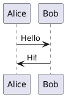

# Typora PlantUML 插件

一个为 Typora 提供 PlantUML 语法支持的独立插件。当用户在代码块中编写 PlantUML 代码时，插件会自动将其渲染为图片。

## 功能特性

- **自动渲染**：识别 ````plantuml` 代码块并自动渲染为图片
- **实时预览**：支持实时渲染模式（编辑时自动更新）
- **手动触发**：支持手动触发渲染（快捷键 `Ctrl+Shift+U`）
- **编辑回退**：双击渲染图片可切换回代码编辑，点击空白处自动重新渲染
- **样式隔离**：所有 CSS 类名使用 `tp_` 前缀，避免与 Typora 原生样式冲突
- **缓存优化**：LRU 缓存策略，避免重复请求服务器
- **深色模式**：支持 Typora 深色模式
- **完全独立**：不依赖任何外部项目

## 安装方法

### 前置要求

- Typora 版本 ≥ 0.9.98（最后一个免费版本）
- Windows、macOS 或 Linux 平台

### 步骤一：创建插件目录

根据您的操作系统，创建插件目录：

- **Windows**: `%APPDATA%\Typora\plugins\` 或 `%LOCALAPPDATA%\Typora\plugins\`
- **macOS**: `~/Library/Application Support/Typora/plugins/`
- **Linux**: `~/.config/Typora/plugins/`

如果目录不存在，请手动创建。

> 也可以将插件放在 Typora 安装目录下的 `resources/plugins/` 文件夹中。

### 步骤二：复制插件文件

将本项目 `plugin` 目录内的所有内容复制到上述插件目录：

```
插件目录（如 %APPDATA%\Typora\plugins\）
├── index.js              (插件加载器入口)
└── custom/
    └── plugins/
        ├── core/         (核心工具模块)
        │   ├── namespace.js
        │   ├── eventBus.js
        │   └── configManager.js
        └── plantuml/     (PlantUML 插件)
            ├── detector.js
            ├── renderer.js
            ├── uiController.js
            └── config.js
```

### 步骤三：修改 window.html

根据您的 Typora 版本，找到 `window.html` 文件：

- **正式版 Typora**: `Typora安装目录/resources/window.html`
- **免费版 Typora**: `Typora安装目录/resources/app/window.html`

在 `window.html` 的 `</body>` 标签前添加一行：

```html
<script src="./plugin/index.js" defer="defer"></script>
```

### 步骤四：重启 Typora

重启 Typora 后，插件将自动生效。您可以在控制台（按 Shift + F12）看到加载成功的提示。

## 使用方法

### 基本使用

在 Typora 中创建 PlantUML 代码块：

````markdown

````

插件会自动检测并渲染为图片。

### 编辑模式

- **双击渲染图片**：切换回代码编辑模式
- **点击空白处**：自动退出编辑模式并重新渲染

### 手动渲染

使用快捷键 `Ctrl+Shift+U` 手动触发渲染（光标需在 PlantUML 代码块内）。

## 配置选项

配置存储在 `localStorage` 中，可通过浏览器控制台修改：

```javascript
// 获取当前配置
JSON.parse(localStorage.getItem('plantuml_plugin_config'))

// 修改配置（示例：切换为手动渲染模式）
localStorage.setItem('plantuml_plugin_config', JSON.stringify({
    renderMode: 'manual'
}))
```

| 选项 | 默认值 | 说明 |
|------|--------|------|
| `serverUrl` | `http://www.plantuml.com/plantuml` | 渲染服务器地址 |
| `renderMode` | `auto` | 渲染模式：`auto`（实时）或 `manual`（手动） |
| `outputFormat` | `svg` | 输出格式：`svg` 或 `png` |
| `timeout` | `10000` | 请求超时时间（毫秒） |
| `cacheLimit` | `20` | 缓存数量上限 |
| `debounceDelay` | `500` | 实时渲染防抖延迟（毫秒） |
| `hotkey` | `ctrl+shift+u` | 手动渲染快捷键 |

## 架构说明

```
┌─────────────────────────────────────────────────────────────┐
│                    PlantUML Plugin                          │
├─────────────────────────────────────────────────────────────┤
│  plugins/index.js        插件加载器入口                      │
├─────────────────────────────────────────────────────────────┤
│  ConfigManager           管理用户配置（localStorage）         │
│  EventBus                插件模块间通信（事件总线）            │
│  NamespaceManager        CSS 命名空间隔离                    │
├─────────────────────────────────────────────────────────────┤
│  Detector                监听 DOM，检测 PlantUML 代码块       │
│  Renderer                编码与请求渲染服务器                  │
│  UIController            管理渲染结果显示与交互                │
└─────────────────────────────────────────────────────────────┘
```

### 核心工作流程

```
1. 初始化：加载配置 → 初始化模块 → 绑定事件 → 启动 DOM 监听

2. 检测：DOM 变化 → 查找 plantuml 代码块 → 提取内容 → 发送事件

3. 渲染：编码内容 → 请求服务器 → 缓存结果 → 显示图片

4. 编辑：双击图片 → 显示代码 → 编辑内容 → 点击空白 → 重新渲染
```

## 文件结构

```
plugins/                        # 插件目录（放在用户数据目录或 Typora resources 下）
├── index.js                   # 插件加载器（入口）
│
└── custom/plugins/
    ├── core/                  # 核心工具模块（可复用）
    │   ├── namespace.js       # CSS 命名空间管理
    │   ├── eventBus.js        # 事件总线
    │   └── configManager.js   # 配置管理
    │
    └── plantuml/              # PlantUML 插件
        ├── detector.js        # 代码块检测
        ├── renderer.js        # 渲染引擎
        ├── uiController.js    # UI 控制
        └── config.js          # 默认配置
```

## 扩展开发

核心模块设计为可复用，便于开发其他插件：

1. 在 `plugins/custom/plugins/` 下创建新插件目录
2. 在插件模块中使用全局变量访问核心工具：
   ```javascript
   // UMD 模块会自动从全局变量获取依赖
   var NamespaceManager = root.NamespaceManager;
   var EventBus = root.EventBus;
   ```
3. 创建插件类并导出（使用 UMD 格式）：
   ```javascript
   (function(root) {
       'use strict';
       
       function MyPlugin(config) {
           this.config = config;
       }
       
       MyPlugin.prototype.init = function() {
           // 使用 NamespaceManager 和 EventBus
       };
       
       // UMD 导出
       if (typeof module !== 'undefined' && module.exports) {
           module.exports = MyPlugin;
       } else {
           root.MyPlugin = MyPlugin;
       }
   })(typeof global !== 'undefined' ? global : window);
   ```
4. 在 `plugins/index.js` 中加载新插件

## 已知限制

- 需要网络连接访问渲染服务器
- 公共服务器（plantuml.com）可能有访问限制或速率限制
- 大型图表可能导致 URL 过长问题

## 故障排除

### 图片不显示

1. 检查网络连接是否正常
2. 按 F12 打开控制台，查看是否有错误信息
3. 检查 `serverUrl` 配置是否正确

### 代码块未被识别

1. 确保代码块语言标识为 `plantuml`（不是 `uml` 或其他）
2. 确保代码块以 `@startuml` 开始，以 `@enduml` 结束
3. 重启 Typora

### 编辑后不自动渲染

1. 点击编辑区域外的空白处触发重新渲染
2. 或使用快捷键 `Ctrl+Shift+U` 手动渲染

### 插件未加载

1. 确认 `window.html` 已正确添加脚本引用
2. 确认插件目录位置正确（用户数据目录或 Typora resources 下的 `plugins` 文件夹）
3. 检查控制台是否有加载错误
4. 确认脚本引用路径正确：`./plugin/index.js`（相对于 window.html 的路径）

## 许可证

MIT License

## 参考

- [PlantUML 官方网站](https://plantuml.com/)
- [typora_plugin 项目](https://github.com/obgnail/typora_plugin) - 参考 Typora 插件架构设计