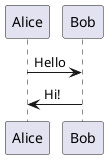

# Typora PlantUML 插件

一个为 Typora 提供 PlantUML 语法支持的插件。当用户在代码块中编写 PlantUML 代码时，插件会自动将其渲染为图片。

## 功能特性

- **自动渲染**：识别 ````plantuml` 代码块并自动渲染为图片
- **实时预览**：支持实时渲染模式（编辑时自动更新）
- **手动触发**：支持手动触发渲染（快捷键 `Ctrl+Shift+U`）
- **编辑回退**：双击渲染图片可切换回代码编辑，点击空白处自动重新渲染
- **样式隔离**：所有 CSS 类名使用 `tp_` 前缀，避免与 Typora 原生样式冲突
- **缓存优化**：LRU 缓存策略，避免重复请求服务器
- **深色模式**：支持 Typora 深色模式
- **可扩展**：核心模块可复用，便于开发其他插件

## 安装方法

### 前置要求

此插件需要配合 Typora 插件注入机制使用。您需要：

1. Typora 版本 ≥ 0.9.98（最后一个免费版本）
2. 修改 Typora 的 `window.html` 文件以注入插件脚本

### 步骤一：找到 window.html

根据您的 Typora 版本，`window.html` 位于不同位置：

- **正式版 Typora**：`Typora安装目录/resources/window.html`
- **免费版 Typora**：`Typora安装目录/resources/app/window.html`

### 步骤二：复制插件文件

将本项目 `plugin` 目录复制到包含 `window.html` 的文件夹下：

```
Typora安装目录/resources/
├── window.html          (或 app/window.html)
└── plugin/
    ├── custom/
    │   └── plugins/
    │       ├── core/
    │       │   ├── namespace.js
    │       │   ├── eventBus.js
    │       │   └── configManager.js
    │       └── plantuml/
    │           ├── index.js
    │           ├── detector.js
    │           ├── renderer.js
    │           ├── uiController.js
    │           └── config.js
    │           └── README.md
    └── global/
        └── settings/
            └── custom_plugin.user.toml  (需手动创建)
```

### 步骤三：修改 window.html

在 `window.html` 中添加插件脚本引用：

```html
<!-- 在原有脚本标签后添加 -->
<script src="./plugin/custom/plugins/core/loader.js" defer></script>
<script src="./plugin/custom/plugins/plantuml/index.js" defer></script>
```

或者创建统一的入口脚本 `plugin/index.js`：

```javascript
window.addEventListener("load", () => {
    // 初始化核心模块
    const NamespaceManager = require("./custom/plugins/core/namespace");
    const EventBus = require("./custom/plugins/core/eventBus");
    global.NamespaceManager = NamespaceManager;
    global.EventBus = EventBus;
    
    // 加载插件
    const PlantUMLPlugin = require("./custom/plugins/plantuml/index");
    // ... 插件初始化逻辑
});
```

### 步骤四：创建配置文件

在 `plugin/global/settings/custom_plugin.user.toml` 中添加：

```toml
[plantuml]
name = "PlantUML"
enable = true
hide = false
order = 1
hotkey = "ctrl+shift+u"
renderMode = "auto"
serverUrl = "http://www.plantuml.com/plantuml"
outputFormat = "svg"
timeout = 10000
cacheLimit = 20
debounceDelay = 500
```

### 步骤五：重启 Typora

重启 Typora 后，插件将自动生效。

## 使用方法

### 基本使用

在 Typora 中创建 PlantUML 代码块：

````markdown

````

插件会自动检测并渲染为图片。

### 编辑模式

- **双击渲染图片**：切换回代码编辑模式
- **点击空白处**：自动退出编辑模式并重新渲染

### 手动渲染

当 `renderMode = "manual"` 时，使用快捷键 `Ctrl+Shift+U` 手动触发渲染。

## 配置选项

| 选项 | 默认值 | 说明 |
|------|--------|------|
| `serverUrl` | `http://www.plantuml.com/plantuml` | 渲染服务器地址 |
| `renderMode` | `auto` | 渲染模式：`auto`（实时）或 `manual`（手动） |
| `outputFormat` | `svg` | 输出格式：`svg` 或 `png` |
| `timeout` | `10000` | 请求超时时间（毫秒） |
| `cacheLimit` | `20` | 缓存数量上限 |
| `debounceDelay` | `500` | 实时渲染防抖延迟（毫秒） |
| `hotkey` | `ctrl+shift+u` | 手动渲染快捷键 |

## 自建渲染服务器

使用 Docker 搭建本地 PlantUML 服务器：

```bash
# 拉取镜像
docker pull plantuml/plantuml-server:jetty

# 启动服务
docker run -d -p 8080:8080 --name plantuml-server plantuml/plantuml-server:jetty
```

然后修改配置：
```toml
serverUrl = "http://localhost:8080"
```

**优势**：
- 无需依赖外部服务
- 渲染速度更快
- 网络请求更稳定

## 架构说明

```
┌─────────────────────────────────────────────────────────────┐
│                    PlantUML Plugin                          │
├─────────────────────────────────────────────────────────────┤
│  ConfigManager          管理用户配置（localStorage）          │
│  EventBus               插件模块间通信（事件总线）             │
│  NamespaceManager       CSS 命名空间隔离                     │
├─────────────────────────────────────────────────────────────┤
│  Detector               监听 DOM，检测 PlantUML 代码块        │
│  Renderer               编码与请求渲染服务器                   │
│  UIController           管理渲染结果显示与交互                 │
├─────────────────────────────────────────────────────────────┤
│  index.js               插件入口，整合所有模块                 │
└─────────────────────────────────────────────────────────────┘
```

### 核心工作流程

```
1. 初始化：加载配置 → 初始化模块 → 绑定事件 → 启动 DOM 监听

2. 检测：DOM 变化 → 查找 plantuml 代码块 → 提取内容 → 发送事件

3. 渲染：编码内容 → 请求服务器 → 缓存结果 → 显示图片

4. 编辑：双击图片 → 显示代码 → 编辑内容 → 点击空白 → 重新渲染
```

## 文件结构

```
plugin/
├── custom/
│   └── plugins/
│       ├── core/                  # 核心基础设施（可复用）
│       │   ├── namespace.js       # CSS 命名空间管理
│       │   ├── eventBus.js        # 插件间事件通信
│       │   └── configManager.js   # localStorage 配置管理
│       │
│       └── plantuml/              # PlantUML 插件
│           ├── index.js           # 插件入口（生命周期）
│           ├── detector.js        # 代码块检测（MutationObserver）
│           ├── renderer.js        # 渲染引擎（编码 + 缓存）
│           ├── uiController.js    # UI 交互（显示/编辑切换）
│           ├── config.js          # 默认配置
│           └── README.md          # 插件文档
│
└── global/
    └── settings/
        └── custom_plugin.user.toml  # 用户配置
```

## 扩展开发

核心模块设计为可复用，便于开发其他插件：

1. 在 `plugin/custom/plugins/` 下创建新插件目录
2. 使用 `require("../core/namespace")` 引入命名空间管理
3. 使用 `require("../core/eventBus")` 引入事件总线
4. 使用 `require("../core/configManager")` 引入配置管理
5. 创建 `index.js` 并导出插件类

## 已知限制

- 需要网络连接访问渲染服务器
- 公共服务器（plantuml.com）可能有访问限制
- 大型图表可能导致 URL 过长问题

## 故障排除

### 图片不显示

1. 检查网络连接
2. 检查 `serverUrl` 配置是否正确
3. 尝试使用自建服务器

### 代码块未被识别

1. 确保代码块语言标识为 `plantuml`
2. 确保 `enable = true` 在配置中
3. 重启 Typora

### 编辑后不自动渲染

1. 确保 `renderMode = "auto"`
2. 点击编辑区域外的空白处触发渲染

## 许可证

MIT License

## 参考

- [PlantUML 官方网站](https://plantuml.com/)
- [PlantUML Server Docker](https://hub.docker.com/r/plantuml/plantuml-server)