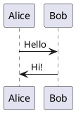
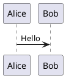

# PlantUML Typora Plugin Implementation Plan

> **For agentic workers:** REQUIRED SUB-SKILL: Use superpowers:subagent-driven-development (recommended) or superpowers:executing-plans to implement this plan task-by-task. Steps use checkbox (`- [ ]`) syntax for tracking.

**Goal:** Build a Typora plugin that renders PlantUML code blocks as images with real-time preview and edit fallback.

**Architecture:** Modular design with core utilities (namespace, eventBus, config) reusable for future plugins. PlantUML-specific modules: detector, renderer, uiController.

**Tech Stack:** JavaScript (ES6), Node.js built-ins (zlib), Browser APIs (MutationObserver, localStorage, fetch), Typora Custom Plugin API (BaseCustomPlugin)

---

## File Structure

```
plugin/custom/plugins/
├── core/                          # Core infrastructure (reusable)
│   ├── namespace.js               # Namespace management (tp_ prefix)
│   ├── eventBus.js                # Plugin inter-communication
│   └── configManager.js           # Config storage (localStorage)
│
├── plantuml/                      # PlantUML plugin
│   ├── index.js                   # Plugin entry point
│   ├── detector.js                # Code block detection
│   ├── renderer.js                # PlantUML encoding + render
│   ├── uiController.js            # UI and interactions
│   ├── config.js                  # Default config
│   └── style.css                  # Plugin styles
│
└── (future plugins can use core/)
```

---

## Task 1: Core Namespace Module

**Files:**
- Create: `plugin/custom/plugins/core/namespace.js`

**Purpose:** Provide consistent prefixing for CSS classes, data attributes, and event names to avoid conflicts with Typora.

- [ ] **Step 1: Write the namespace module**

```javascript
// plugin/custom/plugins/core/namespace.js

const PREFIX = "tp_";

const NamespaceManager = {
    cls: (name) => `${PREFIX}${name}`,
    dataAttr: (name) => `data-${PREFIX}${name}`,
    event: (name) => `${PREFIX}:${name}`,
    selector: (name) => `.${PREFIX}${name}`,
};

module.exports = NamespaceManager;
```

- [ ] **Step 2: Commit**

```bash
git add plugin/custom/plugins/core/namespace.js
git commit -m "feat(core): add namespace module for style isolation"
```

---

## Task 2: Core EventBus Module

**Files:**
- Create: `plugin/custom/plugins/core/eventBus.js`

**Purpose:** Enable decoupled communication between plugin modules.

- [ ] **Step 1: Write the eventBus module**

```javascript
// plugin/custom/plugins/core/eventBus.js

const EventBus = {
    listeners: new Map(),

    on(event, handler) {
        if (!this.listeners.has(event)) {
            this.listeners.set(event, new Set());
        }
        this.listeners.get(event).add(handler);
    },

    off(event, handler) {
        const handlers = this.listeners.get(event);
        if (handlers) {
            handlers.delete(handler);
        }
    },

    emit(event, data) {
        const handlers = this.listeners.get(event);
        if (handlers) {
            handlers.forEach(handler => {
                try {
                    handler(data);
                } catch (e) {
                    console.error(`EventBus handler error [${event}]:`, e);
                }
            });
        }
    },

    once(event, handler) {
        const wrapper = (data) => {
            handler(data);
            this.off(event, wrapper);
        };
        this.on(event, wrapper);
    },
};

module.exports = EventBus;
```

- [ ] **Step 2: Commit**

```bash
git add plugin/custom/plugins/core/eventBus.js
git commit -m "feat(core): add eventBus for plugin inter-communication"
```

---

## Task 3: Core ConfigManager Module

**Files:**
- Create: `plugin/custom/plugins/core/configManager.js`

**Purpose:** Manage plugin configuration with localStorage persistence.

- [ ] **Step 1: Write the configManager module**

```javascript
// plugin/custom/plugins/core/configManager.js

const ConfigManager = {
    create(storageKey, defaultConfig) {
        return {
            storageKey,
            defaultConfig,
            _cache: null,

            get(key) {
                const config = this.getAll();
                return key ? config[key] : config;
            },

            getAll() {
                if (this._cache) return this._cache;

                try {
                    const stored = localStorage.getItem(this.storageKey);
                    if (stored) {
                        this._cache = { ...this.defaultConfig, ...JSON.parse(stored) };
                        return this._cache;
                    }
                } catch (e) {
                    console.warn("ConfigManager: Failed to read config:", e);
                }

                this._cache = { ...this.defaultConfig };
                return this._cache;
            },

            set(key, value) {
                const config = this.getAll();
                config[key] = value;
                this._save();
            },

            setAll(config) {
                this._cache = { ...this.defaultConfig, ...config };
                this._save();
            },

            reset() {
                this._cache = { ...this.defaultConfig };
                this._save();
            },

            _save() {
                try {
                    localStorage.setItem(this.storageKey, JSON.stringify(this._cache));
                } catch (e) {
                    console.error("ConfigManager: Failed to save config:", e);
                }
            },
        };
    },
};

module.exports = ConfigManager;
```

- [ ] **Step 2: Commit**

```bash
git add plugin/custom/plugins/core/configManager.js
git commit -m "feat(core): add configManager for localStorage persistence"
```

---

## Task 4: PlantUML Default Config

**Files:**
- Create: `plugin/custom/plugins/plantuml/config.js`

**Purpose:** Define default configuration values for PlantUML plugin.

- [ ] **Step 1: Write the config module**

```javascript
// plugin/custom/plugins/plantuml/config.js

const defaultConfig = {
    // Render server URL (default to public PlantUML server)
    serverUrl: "http://www.plantuml.com/plantuml",

    // Render mode: "auto" (real-time) or "manual" (trigger on demand)
    renderMode: "auto",

    // Output format: "svg" or "png"
    outputFormat: "svg",

    // Request timeout in milliseconds
    timeout: 10000,

    // Cache limit (number of rendered images to cache)
    cacheLimit: 20,

    // Debounce delay for real-time rendering (ms)
    debounceDelay: 500,
};

module.exports = defaultConfig;
```

- [ ] **Step 2: Commit**

```bash
git add plugin/custom/plugins/plantuml/config.js
git commit -m "feat(plantuml): add default config"
```

---

## Task 5: PlantUML Renderer Module

**Files:**
- Create: `plugin/custom/plugins/plantuml/renderer.js`

**Purpose:** Handle PlantUML encoding (deflate + custom base64) and server requests.

- [ ] **Step 1: Write the renderer module**

```javascript
// plugin/custom/plugins/plantuml/renderer.js

// PlantUML uses a custom base64 character set
const UML_CHARS = "0123456789ABCDEFGHIJKLMNOPQRSTUVWXYZabcdefghijklmnopqrstuvwxyz-_";
const B64_CHARS = "ABCDEFGHIJKLMNOPQRSTUVWXYZabcdefghijklmnopqrstuvwxyz0123456789+/";

class PlantUMLRenderer {
    constructor(config) {
        this.config = config;
        this.cache = new Map();
    }

    // Encode PlantUML text for server URL
    encode(text) {
        // Use Node.js zlib for deflate compression
        const zlib = require("zlib");

        // 1. Deflate compress
        const compressed = zlib.deflateRawSync(Buffer.from(text, "utf-8"));

        // 2. Convert to standard base64
        const base64 = compressed.toString("base64");

        // 3. Map to PlantUML's custom character set
        let result = "";
        for (let i = 0; i < base64.length; i++) {
            const c = base64[i];
            if (c >= "A" && c <= "Z") {
                result += UML_CHARS[c.charCodeAt(0) - 65 + 10];
            } else if (c >= "a" && c <= "z") {
                result += UML_CHARS[c.charCodeAt(0) - 97 + 36];
            } else if (c >= "0" && c <= "9") {
                result += UML_CHARS[c.charCodeAt(0) - 48];
            } else if (c === "+") {
                result += "-";
            } else if (c === "/") {
                result += "_";
            } else {
                result += c; // '=' remains as is
            }
        }
        return result;
    }

    // Render PlantUML content, return image URL
    async render(content) {
        // Check cache first
        const cacheKey = this._hashContent(content);
        if (this.cache.has(cacheKey)) {
            return this.cache.get(cacheKey);
        }

        // Encode and build URL
        const encoded = this.encode(content);
        const url = `${this.config.serverUrl}/${this.config.outputFormat}/${encoded}`;

        // Preload image to verify it works
        await this._loadImage(url);

        // Cache result
        this._addToCache(cacheKey, url);

        return url;
    }

    // Preload image with timeout
    async _loadImage(url) {
        return new Promise((resolve, reject) => {
            const img = new Image();
            const timeout = setTimeout(() => {
                img.src = "";
                reject(new Error("Image load timeout"));
            }, this.config.timeout);

            img.onload = () => {
                clearTimeout(timeout);
                resolve(url);
            };

            img.onerror = () => {
                clearTimeout(timeout);
                reject(new Error("Failed to load image"));
            };

            img.src = url;
        });
    }

    // Simple content hash for caching
    _hashContent(content) {
        let hash = 0;
        for (let i = 0; i < content.length; i++) {
            const char = content.charCodeAt(i);
            hash = ((hash << 5) - hash) + char;
            hash = hash & hash;
        }
        return Math.abs(hash).toString(16);
    }

    // Add to cache with LRU eviction
    _addToCache(key, value) {
        // Evict oldest if over limit
        if (this.cache.size >= this.config.cacheLimit) {
            const firstKey = this.cache.keys().next().value;
            this.cache.delete(firstKey);
        }
        this.cache.set(key, value);
    }

    // Clear cache
    clearCache() {
        this.cache.clear();
    }
}

module.exports = PlantUMLRenderer;
```

- [ ] **Step 2: Commit**

```bash
git add plugin/custom/plugins/plantuml/renderer.js
git commit -m "feat(plantuml): add renderer with encoding and caching"
```

---

## Task 6: PlantUML Detector Module

**Files:**
- Create: `plugin/custom/plugins/plantuml/detector.js`

**Purpose:** Monitor DOM changes and detect PlantUML code blocks.

- [ ] **Step 1: Write the detector module**

```javascript
// plugin/custom/plugins/plantuml/detector.js

const NamespaceManager = require("../core/namespace");
const EventBus = require("../core/eventBus");

class PlantUMLDetector {
    constructor() {
        this.observer = null;
        this.blocks = new Map();
        this.ns = NamespaceManager;
    }

    // Start monitoring DOM
    start() {
        const editor = document.querySelector("#write");
        if (!editor) {
            console.error("PlantUML Detector: Editor not found");
            return;
        }

        // Initial scan
        this._scanExistingBlocks();

        // Start observing
        this.observer = new MutationObserver((mutations) => {
            this._handleMutations(mutations);
        });

        this.observer.observe(editor, {
            childList: true,
            subtree: true,
            attributes: true,
            attributeFilter: ["class", "data-lang"],
        });
    }

    // Stop monitoring
    stop() {
        if (this.observer) {
            this.observer.disconnect();
            this.observer = null;
        }
        this.blocks.clear();
    }

    // Scan existing blocks on start
    _scanExistingBlocks() {
        const blocks = document.querySelectorAll('pre.md-fences[data-lang="plantuml"]');
        blocks.forEach((block) => this._registerBlock(block));
    }

    // Handle DOM mutations
    _handleMutations(mutations) {
        for (const mutation of mutations) {
            if (mutation.type === "childList") {
                for (const node of mutation.addedNodes) {
                    this._checkNode(node);
                }
            } else if (mutation.type === "attributes") {
                this._checkNode(mutation.target);
            }
        }
    }

    // Check if node contains PlantUML blocks
    _checkNode(node) {
        if (!node.querySelectorAll && !node.matches) return;

        const blocks = node.querySelectorAll?.('pre.md-fences[data-lang="plantuml"]')
            || (node.matches?.('pre.md-fences[data-lang="plantuml"]') ? [node] : []);

        for (const block of blocks) {
            this._registerBlock(block);
        }
    }

    // Register a new code block
    _registerBlock(element) {
        // Skip if already registered
        if (element.hasAttribute(this.ns.dataAttr("block-id"))) return;

        const blockId = this._generateId();
        element.setAttribute(this.ns.dataAttr("block-id"), blockId);

        const content = this._extractContent(element);
        this.blocks.set(blockId, { element, content, state: "pending" });

        // Emit event
        EventBus.emit("plantuml:block-detected", { blockId, content });
    }

    // Extract code content from element
    _extractContent(element) {
        // Typora uses CodeMirror for code blocks
        const cmContent = element.querySelector(".CodeMirror-code");
        if (cmContent) {
            // Get text from CodeMirror lines
            const lines = cmContent.querySelectorAll(".CodeMirror-line");
            return Array.from(lines).map(line => line.textContent).join("\n");
        }

        // Fallback: direct text content
        const codeElement = element.querySelector("code") || element;
        return codeElement.textContent || "";
    }

    // Generate unique block ID
    _generateId() {
        return `plantuml-${Date.now()}-${Math.random().toString(36).substr(2, 9)}`;
    }

    // Get block info
    getBlock(blockId) {
        return this.blocks.get(blockId);
    }

    // Update block content (after edit)
    updateBlockContent(blockId) {
        const block = this.blocks.get(blockId);
        if (!block) return;

        const newContent = this._extractContent(block.element);

        // Only emit if content actually changed
        if (newContent !== block.content) {
            block.content = newContent;
            block.state = "modified";
            EventBus.emit("plantuml:block-updated", { blockId, content: newContent });
        }
    }

    // Find current block (for manual trigger)
    findCurrentBlock() {
        const activeElement = document.activeElement;
        if (!activeElement) return null;

        const block = activeElement.closest('pre.md-fences[data-lang="plantuml"]');
        if (!block) return null;

        const blockId = block.getAttribute(this.ns.dataAttr("block-id"));
        return blockId ? { id: blockId, ...this.blocks.get(blockId) } : null;
    }
}

module.exports = PlantUMLDetector;
```

- [ ] **Step 2: Commit**

```bash
git add plugin/custom/plugins/plantuml/detector.js
git commit -m "feat(plantuml): add detector for code block monitoring"
```

---

## Task 7: PlantUML UI Controller Module

**Files:**
- Create: `plugin/custom/plugins/plantuml/uiController.js`

**Purpose:** Manage rendered image display and edit fallback interactions.

- [ ] **Step 1: Write the uiController module**

```javascript
// plugin/custom/plugins/plantuml/uiController.js

const NamespaceManager = require("../core/namespace");
const EventBus = require("../core/eventBus");

class PlantUMLUIController {
    constructor() {
        this.ns = NamespaceManager;
        this.activeBlockId = null;
        this.exitHandler = null;
    }

    // Create preview container and insert after code block
    createPreview(blockId, originalElement, imageUrl) {
        // Create container
        const container = document.createElement("div");
        container.className = this.ns.cls("preview-container");
        container.setAttribute(this.ns.dataAttr("block-id"), blockId);
        container.setAttribute(this.ns.dataAttr("state"), "rendered");

        // Create image
        const img = document.createElement("img");
        img.src = imageUrl;
        img.className = this.ns.cls("preview-image");
        img.alt = "PlantUML Diagram";

        // Create toolbar
        const toolbar = this._createToolbar(blockId);

        // Assemble
        container.appendChild(img);
        container.appendChild(toolbar);

        // Hide original block and insert preview
        originalElement.style.display = "none";
        originalElement.insertAdjacentElement("afterend", container);

        // Bind events
        this._bindEvents(container, blockId, originalElement);

        return container;
    }

    // Create toolbar with edit/refresh buttons
    _createToolbar(blockId) {
        const toolbar = document.createElement("div");
        toolbar.className = this.ns.cls("toolbar");

        const editBtn = document.createElement("button");
        editBtn.className = this.ns.cls("toolbar-btn edit-btn");
        editBtn.textContent = "Edit";
        editBtn.onclick = () => this.enterEditMode(blockId);

        const refreshBtn = document.createElement("button");
        refreshBtn.className = this.ns.cls("toolbar-btn refresh-btn");
        refreshBtn.textContent = "Refresh";
        refreshBtn.onclick = () => EventBus.emit("plantuml:refresh-requested", { blockId });

        toolbar.appendChild(editBtn);
        toolbar.appendChild(refreshBtn);

        return toolbar;
    }

    // Bind interaction events
    _bindEvents(container, blockId, originalElement) {
        const img = container.querySelector(`.${this.ns.cls("preview-image")}`);

        // Double-click to edit
        img.addEventListener("dblclick", (e) => {
            e.preventDefault();
            this.enterEditMode(blockId);
        });

        // Single-click to enlarge (optional future feature)
        img.addEventListener("click", (e) => {
            // Placeholder for enlarge feature
        });
    }

    // Enter edit mode: show code, hide preview
    enterEditMode(blockId) {
        const preview = document.querySelector(`[${this.ns.dataAttr("block-id")}="${blockId}"].${this.ns.cls("preview-container")}`);
        const codeBlock = document.querySelector(`pre[${this.ns.dataAttr("block-id")}="${blockId}"]`);

        if (!preview || !codeBlock) return;

        // Hide preview
        preview.style.display = "none";

        // Show code block and focus
        codeBlock.style.display = "";
        codeBlock.focus();

        this.activeBlockId = blockId;

        // Set up exit handler
        this._setupExitHandler(blockId);
    }

    // Set up handler to exit edit mode on outside click
    _setupExitHandler(blockId) {
        // Remove previous handler if exists
        if (this.exitHandler) {
            document.removeEventListener("click", this.exitHandler);
        }

        this.exitHandler = (e) => {
            const block = document.querySelector(`[${this.ns.dataAttr("block-id")}="${blockId}"]`);
            if (!block) return;

            const preview = document.querySelector(`[${this.ns.dataAttr("block-id")}="${blockId}"].${this.ns.cls("preview-container")}`);
            const codeBlock = document.querySelector(`pre[${this.ns.dataAttr("block-id")}="${blockId}"]`);

            // Check if click is outside both preview and code block
            if (preview && codeBlock &&
                !preview.contains(e.target) &&
                !codeBlock.contains(e.target)) {

                this.exitEditMode(blockId);
            }
        };

        // Delay to avoid immediate trigger
        setTimeout(() => {
            document.addEventListener("click", this.exitHandler);
        }, 100);
    }

    // Exit edit mode: re-render and show preview
    exitEditMode(blockId) {
        // Remove exit handler
        if (this.exitHandler) {
            document.removeEventListener("click", this.exitHandler);
            this.exitHandler = null;
        }

        // Request update from detector
        EventBus.emit("plantuml:exit-edit", { blockId });

        this.activeBlockId = null;
    }

    // Show preview (hide code)
    showPreview(blockId) {
        const preview = document.querySelector(`[${this.ns.dataAttr("block-id")}="${blockId}"].${this.ns.cls("preview-container")}`);
        const codeBlock = document.querySelector(`pre[${this.ns.dataAttr("block-id")}="${blockId}"]`);

        if (preview) preview.style.display = "";
        if (codeBlock) codeBlock.style.display = "none";
    }

    // Show loading state
    showLoading(blockId) {
        const preview = document.querySelector(`[${this.ns.dataAttr("block-id")}="${blockId}"].${this.ns.cls("preview-container")}`);
        if (!preview) return;

        preview.innerHTML = `<div class="${this.ns.cls("loading")}"></div>`;
        preview.setAttribute(this.ns.dataAttr("state"), "loading");
    }

    // Show error message
    showError(blockId, error) {
        const preview = document.querySelector(`[${this.ns.dataAttr("block-id")}="${blockId}"].${this.ns.cls("preview-container")}`);
        if (!preview) return;

        preview.innerHTML = `
            <div class="${this.ns.cls("error")}">
                <span class="${this.ns.cls("error-icon")}">⚠</span>
                <span class="${this.ns.cls("error-message")}">${this._escapeHtml(error.message || "Render failed")}</span>
                <button class="${this.ns.cls("retry-btn")}">Retry</button>
            </div>
        `;
        preview.setAttribute(this.ns.dataAttr("state"), "error");

        // Bind retry button
        const retryBtn = preview.querySelector(`.${this.ns.cls("retry-btn")}`);
        if (retryBtn) {
            retryBtn.onclick = () => EventBus.emit("plantuml:refresh-requested", { blockId });
        }
    }

    // Escape HTML for safe display
    _escapeHtml(text) {
        const div = document.createElement("div");
        div.textContent = text;
        return div.innerHTML;
    }

    // Remove preview
    removePreview(blockId) {
        const preview = document.querySelector(`[${this.ns.dataAttr("block-id")}="${blockId}"].${this.ns.cls("preview-container")}`);
        if (preview) preview.remove();

        const codeBlock = document.querySelector(`pre[${this.ns.dataAttr("block-id")}="${blockId}"]`);
        if (codeBlock) codeBlock.style.display = "";
    }
}

module.exports = PlantUMLUIController;
```

- [ ] **Step 2: Commit**

```bash
git add plugin/custom/plugins/plantuml/uiController.js
git commit -m "feat(plantuml): add UI controller with edit fallback"
```

---

## Task 8: PlantUML Styles

**Files:**
- Create: `plugin/custom/plugins/plantuml/style.css`

**Purpose:** Provide isolated styles with tp_ prefix.

- [ ] **Step 1: Write the CSS styles**

```css
/* plugin/custom/plugins/plantuml/style.css */

/* Preview container */
.tp_preview-container {
    margin: 16px 0;
    padding: 12px;
    background: var(--bg-color, #f8f9fa);
    border-radius: 8px;
    border: 1px solid var(--border-color, #e9ecef);
    position: relative;
}

/* Preview image */
.tp_preview-image {
    max-width: 100%;
    height: auto;
    display: block;
    margin: 0 auto;
    cursor: pointer;
}

/* Toolbar */
.tp_toolbar {
    position: absolute;
    top: 8px;
    right: 8px;
    display: flex;
    gap: 4px;
    opacity: 0;
    transition: opacity 0.2s ease;
}

.tp_preview-container:hover .tp_toolbar {
    opacity: 1;
}

.tp_toolbar-btn {
    padding: 4px 12px;
    background: var(--btn-bg, white);
    border: 1px solid var(--btn-border, #dee2e6);
    border-radius: 4px;
    cursor: pointer;
    font-size: 12px;
    font-family: inherit;
    color: var(--text-color, #333);
}

.tp_toolbar-btn:hover {
    background: var(--btn-hover-bg, #f1f3f4);
}

/* Error display */
.tp_error {
    padding: 16px;
    background: var(--error-bg, #fff3cd);
    border: 1px solid var(--error-border, #ffc107);
    border-radius: 4px;
    color: var(--error-text, #856404);
    display: flex;
    align-items: center;
    gap: 8px;
    flex-wrap: wrap;
}

.tp_error-icon {
    font-size: 18px;
}

.tp_error-message {
    flex: 1;
    min-width: 100px;
    font-family: monospace;
    word-break: break-word;
}

.tp_retry-btn {
    padding: 4px 12px;
    background: var(--retry-bg, #ffc107);
    border: none;
    border-radius: 4px;
    cursor: pointer;
    font-family: inherit;
}

.tp_retry-btn:hover {
    background: var(--retry-hover-bg, #e0a800);
}

/* Loading state */
.tp_loading {
    display: flex;
    align-items: center;
    justify-content: center;
    padding: 32px;
    min-height: 100px;
}

.tp_loading::after {
    content: "";
    width: 32px;
    height: 32px;
    border: 3px solid var(--spinner-border, #e9ecef);
    border-top-color: var(--spinner-accent, #007bff);
    border-radius: 50%;
    animation: tp_spin 1s linear infinite;
}

@keyframes tp_spin {
    to {
        transform: rotate(360deg);
    }
}

/* Dark mode support */
@media (prefers-color-scheme: dark) {
    .tp_preview-container {
        --bg-color: #2d2d2d;
        --border-color: #404040;
        --btn-bg: #3d3d3d;
        --btn-border: #505050;
        --btn-hover-bg: #4d4d4d;
        --text-color: #e0e0e0;
        --error-bg: #4d3d00;
        --error-border: #665200;
        --error-text: #ffd966;
        --retry-bg: #665200;
        --retry-hover-bg: #806600;
        --spinner-border: #404040;
        --spinner-accent: #4da6ff;
    }
}
```

- [ ] **Step 2: Commit**

```bash
git add plugin/custom/plugins/plantuml/style.css
git commit -m "feat(plantuml): add styles with dark mode support"
```

---

## Task 9: PlantUML Plugin Entry Point

**Files:**
- Create: `plugin/custom/plugins/plantuml/index.js`

**Purpose:** Integrate all modules and implement plugin lifecycle.

- [ ] **Step 1: Write the main plugin entry**

```javascript
// plugin/custom/plugins/plantuml/index.js

const NamespaceManager = require("../core/namespace");
const EventBus = require("../core/eventBus");
const ConfigManager = require("../core/configManager");
const defaultConfig = require("./config");
const PlantUMLDetector = require("./detector");
const PlantUMLRenderer = require("./renderer");
const PlantUMLUIController = require("./uiController");

class PlantUMLPlugin extends BaseCustomPlugin {
    constructor() {
        super();
        this.configManager = null;
        this.detector = null;
        this.renderer = null;
        this.ui = null;
        this.ns = NamespaceManager;
        this.debounceTimers = new Map();
    }

    // Plugin configuration
    selector = () => null; // Available everywhere

    style = () => {
        // Load CSS from style.css
        return require("./style.css");
    };

    html = () => null;

    hotkey = () => [this.config.hotkey];

    hint = () => "Render PlantUML diagram";

    // Lifecycle: Initialize
    init = () => {
        // Create config manager
        this.configManager = ConfigManager.create("plantuml_plugin_config", defaultConfig);

        // Get merged config (default + user overrides)
        this.config = this.configManager.getAll();

        // Initialize modules
        this.detector = new PlantUMLDetector();
        this.renderer = new PlantUMLRenderer(this.config);
        this.ui = new PlantUMLUIController();

        // Bind events
        this._bindEvents();
    };

    // Lifecycle: Main processing
    process = () => {
        // Start detector if in auto mode
        if (this.config.renderMode === "auto") {
            this.detector.start();
        }
    };

    // Callback: Manual trigger from menu/hotkey
    callback = (anchorNode) => {
        const block = this.detector.findCurrentBlock();
        if (block) {
            this._renderBlock(block.id, block.content);
        } else {
            this.utils.notification.show("No PlantUML code block found");
        }
    };

    // Bind EventBus listeners
    _bindEvents = () => {
        // New block detected
        EventBus.on("plantuml:block-detected", ({ blockId, content }) => {
            if (this.config.renderMode === "auto") {
                this._renderBlockDebounced(blockId, content);
            }
        });

        // Block content updated
        EventBus.on("plantuml:block-updated", ({ blockId, content }) => {
            if (this.config.renderMode === "auto") {
                this._renderBlockDebounced(blockId, content);
            }
        });

        // Manual refresh requested
        EventBus.on("plantuml:refresh-requested", ({ blockId }) => {
            const block = this.detector.getBlock(blockId);
            if (block) {
                this._renderBlock(blockId, block.content);
            }
        });

        // Exit edit mode
        EventBus.on("plantuml:exit-edit", ({ blockId }) => {
            this.detector.updateBlockContent(blockId);
        });
    };

    // Render a block
    _renderBlock = async (blockId, content) => {
        const block = this.detector.getBlock(blockId);
        if (!block) return;

        try {
            block.state = "rendering";
            this.ui.showLoading(blockId);

            const imageUrl = await this.renderer.render(content);
            this.ui.createPreview(blockId, block.element, imageUrl);

            block.state = "rendered";
        } catch (error) {
            block.state = "error";
            this.ui.showError(blockId, error);
            console.error(`PlantUML render error [${blockId}]:`, error);
        }
    };

    // Debounced render for real-time preview
    _renderBlockDebounced = (blockId, content) => {
        // Clear existing timer
        if (this.debounceTimers.has(blockId)) {
            clearTimeout(this.debounceTimers.get(blockId));
        }

        // Set new timer
        this.debounceTimers.set(blockId, setTimeout(() => {
            this._renderBlock(blockId, content);
            this.debounceTimers.delete(blockId);
        }, this.config.debounceDelay));
    };

    // Cleanup
    afterProcess = () => {
        // Clean up debounce timers
        this.debounceTimers.forEach(timer => clearTimeout(timer));
        this.debounceTimers.clear();
    };
}

module.exports = { plugin: PlantUMLPlugin };
```

- [ ] **Step 2: Commit**

```bash
git add plugin/custom/plugins/plantuml/index.js
git commit -m "feat(plantuml): add main plugin entry with lifecycle"
```

---

## Task 10: Add TOML Configuration

**Files:**
- Modify: `plugin/global/settings/custom_plugin.user.toml`

**Purpose:** Register PlantUML plugin in Typora's custom plugin settings.

- [ ] **Step 1: Add configuration entry**

Add the following to `plugin/global/settings/custom_plugin.user.toml`:

```toml
[plantuml]
name = "PlantUML"
enable = true
hide = false
order = 1

# Hotkey to manually trigger render
hotkey = "ctrl+shift+u"

# Render mode: "auto" for real-time, "manual" for on-demand
renderMode = "auto"

# Server URL (default: public PlantUML server)
serverUrl = "http://www.plantuml.com/plantuml"

# Output format: "svg" or "png"
outputFormat = "svg"

# Request timeout (ms)
timeout = 10000

# Cache limit
cacheLimit = 20

# Debounce delay for auto mode (ms)
debounceDelay = 500
```

- [ ] **Step 2: Commit**

```bash
git add plugin/global/settings/custom_plugin.user.toml
git commit -m "feat(plantuml): add TOML configuration"
```

---

## Task 11: Integration Test

**Files:**
- Test manually in Typora

**Purpose:** Verify end-to-end functionality.

- [ ] **Step 1: Create test file**

Create a test markdown file with PlantUML content:

````markdown
# PlantUML Test


````

- [ ] **Step 2: Restart Typora**

Restart Typora to load the plugin.

- [ ] **Step 3: Verify rendering**

- Open Chrome DevTools (F12)
- Check console for "PlantUML Plugin" messages
- Verify the code block is replaced with rendered image
- Double-click image to enter edit mode
- Click outside to exit and re-render

- [ ] **Step 4: Test hotkey**

Press `Ctrl+Shift+U` with cursor inside a PlantUML block to manually trigger render.

---

## Task 12: Final Documentation

**Files:**
- Create: `plugin/custom/plugins/plantuml/README.md`

**Purpose:** Document plugin usage and configuration.

- [ ] **Step 1: Write documentation**

```markdown
# PlantUML Plugin for Typora

Automatically renders PlantUML diagrams in code blocks.

## Installation

1. Copy `core/` and `plantuml/` folders to `plugin/custom/plugins/`
2. Add configuration to `plugin/global/settings/custom_plugin.user.toml`
3. Restart Typora

## Usage

Write PlantUML code in fenced code blocks:



## Configuration

| Option | Default | Description |
|--------|---------|-------------|
| serverUrl | http://www.plantuml.com/plantuml | Render server URL |
| renderMode | auto | "auto" or "manual" |
| outputFormat | svg | "svg" or "png" |
| timeout | 10000 | Request timeout (ms) |

## Self-hosted Server

Run your own PlantUML server with Docker:

```bash
docker pull plantuml/plantuml-server:jetty
docker run -d -p 8080:8080 plantuml/plantuml-server:jetty
```

Then set `serverUrl = "http://localhost:8080"`

## Hotkey

- `Ctrl+Shift+U`: Manually render current PlantUML block

## Edit Mode

- Double-click rendered image to edit source
- Click outside editing area to re-render
```

- [ ] **Step 2: Commit all changes**

```bash
git add plugin/custom/plugins/plantuml/README.md
git commit -m "docs(plantuml): add plugin README"
```

---

## Summary

After completing all tasks:

```bash
git log --oneline -15
```

Expected commits:
1. `feat(core): add namespace module for style isolation`
2. `feat(core): add eventBus for plugin inter-communication`
3. `feat(core): add configManager for localStorage persistence`
4. `feat(plantuml): add default config`
5. `feat(plantuml): add renderer with encoding and caching`
6. `feat(plantuml): add detector for code block monitoring`
7. `feat(plantuml): add UI controller with edit fallback`
8. `feat(plantuml): add styles with dark mode support`
9. `feat(plantuml): add main plugin entry with lifecycle`
10. `feat(plantuml): add TOML configuration`
11. `docs(plantuml): add plugin README`
