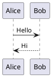

# PlantUML Plugin for Typora

这个目录保存 PlantUML 插件本体。当前实现已经收敛为“模块 + 共享 runtime”结构，供两条入口共同复用。

## 目录说明

- `config.js`
  默认配置
- `detector.js`
  代码块注册、内容提取、块删除/语言切换清理
- `renderer.js`
  PlantUML 编码和图片加载
- `renderPolicy.js`
  判定当前内容是否应该渲染
- `uiController.js`
  预览、编辑态、错误态管理
- `autocomplete.js`
  ` ```pla ` 到 ` ```plantuml ` 的围栏补全
- `runtime.js`
  共享运行时。统一绑定事件、防抖渲染、快捷键和生命周期
- `index.js`
  独立插件类入口，内部同样复用 `runtime.js`

## 当前行为

- 识别 `lang="plantuml"` 的 fenced code block
- 初始扫描和后续新增块都能自动注册
- 块内内容变化会重新提取并触发更新
- 空块和未闭合 `@start.../@end...` 的内容会跳过渲染
- 块删除或语言改走时会清理预览和内部状态
- `Ctrl+Shift+U` 手动刷新当前块
- 双击预览图回到编辑态
- 输入 ` ```pla ` 时出现 `plantuml` 补全

## 配置

当前独立运行模式配置来自 `localStorage` 键 `plantuml_plugin_config`，默认值在 `config.js`：

| Option | Default | Description |
|--------|---------|-------------|
| serverUrl | http://www.plantuml.com/plantuml | Render server URL |
| renderMode | auto | `auto` or `manual` |
| outputFormat | svg | `svg` or `png` |
| timeout | 10000 | Request timeout (ms) |
| cacheLimit | 20 | Render URL cache size |
| debounceDelay | 500 | Debounce delay for auto mode |
| hotkey | ctrl+shift+u | Manual refresh hotkey |
| enableFenceAutocomplete | true | Enable `plantuml` fence suggestion |
| fenceAutocompleteMinChars | 3 | Minimum typed chars before suggestion |

`plugin/global/settings/custom_plugin.user.toml` 在当前仓库里保留为参考配置文件，不是独立入口的实际读取源。

## 示例


