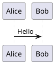

# PlantUML Plugin for Typora

Automatically renders PlantUML diagrams in code blocks.

## Installation

1. Copy `core/` and `plantuml/` folders to `plugin/custom/plugins/`
2. Add configuration to `plugin/global/settings/custom_plugin.user.toml`
3. Restart Typora

## Usage

Write PlantUML code in fenced code blocks:



## Configuration

| Option | Default | Description |
|--------|---------|-------------|
| serverUrl | http://www.plantuml.com/plantuml | Render server URL |
| renderMode | auto | "auto" or "manual" |
| outputFormat | svg | "svg" or "png" |
| timeout | 10000 | Request timeout (ms) |

## Self-hosted Server

Run your own PlantUML server with Docker:

```bash
docker pull plantuml/plantuml-server:jetty
docker run -d -p 8080:8080 plantuml/plantuml-server:jetty
```

Then set `serverUrl = "http://localhost:8080"`

## Hotkey

- `Ctrl+Shift+U`: Manually render current PlantUML block

## Edit Mode

- Double-click rendered image to edit source
- Click outside editing area to re-render